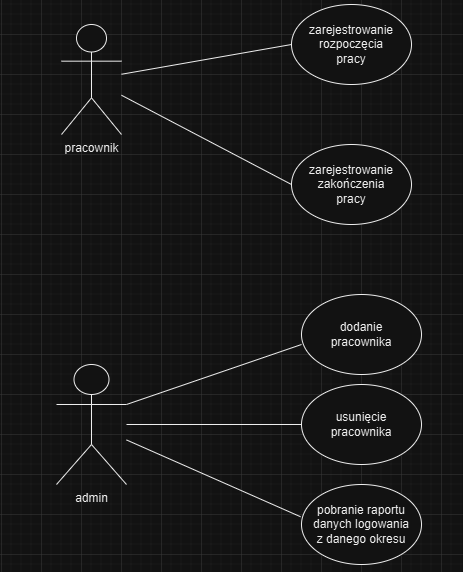
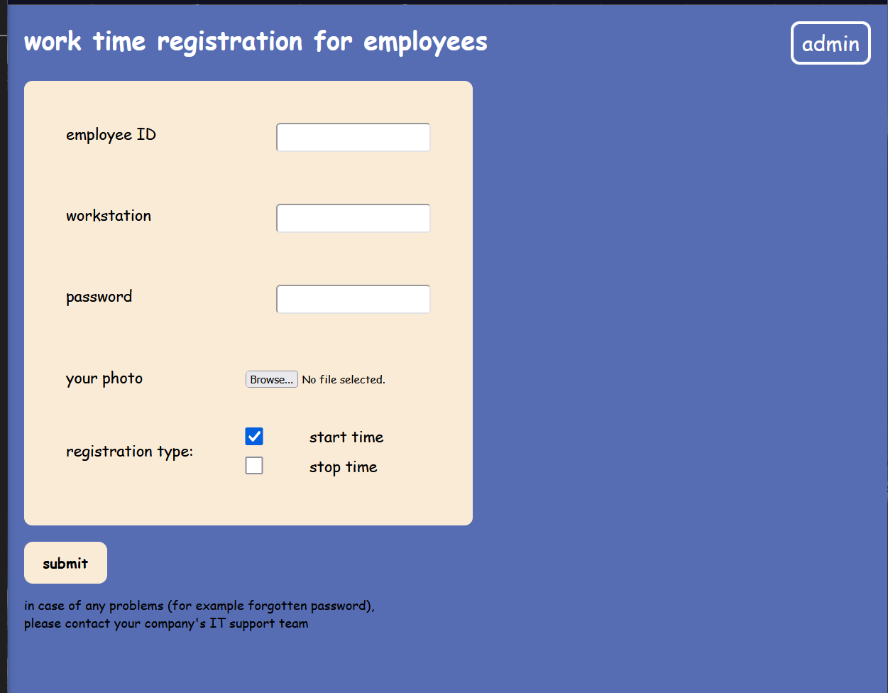
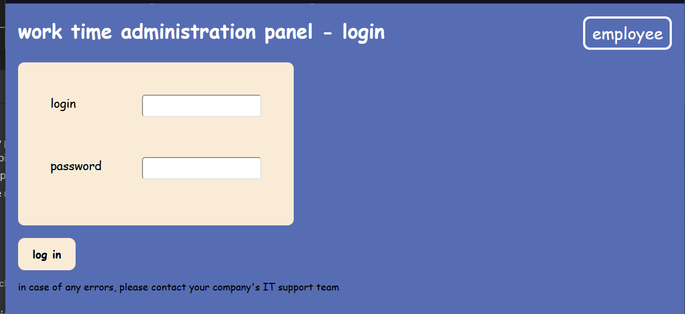
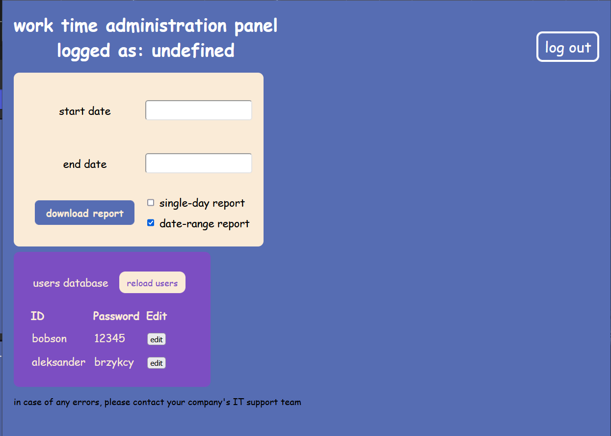

# Dokumentacja inżynierii wymagań

## Członkowie zespołu

- Stanisław Niemczewski
- Paweł Młodkowski
- Igor Lechowski
- Aleksander Brzykcy

### Macierz kompetencji zespołu

| **Kompetencje**           | **Stanisław Niemczewski** | **Paweł Młodkowski** | **Igor Lechowski** | **Aleksander Brzykcy** |
| ------------------------- | ------------------------- | -------------------- | ------------------ | ---------------------- |
| Java                      | 🟨                        | 🟩                   | 🟨                 | 🟨                     |
| C/C++                     | 🟩                        | 🟩                   | 🟨                 | 🟩                     |
| JavaScript                | 🟩                        | 🟥                   | 🟥                 | 🟥                     |
| Python                    | 🟨                        | 🟩                   | 🟨                 | 🟨                     |
| HTML/CSS                  | 🟩                        | 🟩                   | 🟩                 | 🟩                     |
| Rust                      | 🟥                        | 🟩                   | 🟥                 | 🟥                     |
| PostgreSQL                | 🟨                        | 🟨                   | 🟥                 | 🟨                     |
| sqlite3                   | 🟥                        | 🟨                   | 🟨                 | 🟥                     |
| UML                       | 🟥                        | 🟨                   | 🟩                 | 🟨                     |
| Testowanie oprogramowania | 🟥                        | 🟨                   | 🟩                 | 🟨                     |

#### Legenda

| **Oznaczenie** | **Opis** |
| --- | --- |
| 🟩 | posiada |
| 🟨 | posiada (podstawy) |
| 🟥 | nie posiada |

### Szczegóły dotyczące zadanego projektu

| **Pytanie** | **Odpowiedź** | **Uwagi** |
| ----------- | ------------- | --------- |
| Jaki jest cel projektu?                   | aplikacja webowa do kontroli czasu pracy pracowników.                         | Cel powinien być jasno określony i mierzalny      |
| Kto jest głównym odbiorcą/użytkownikiem?  | firmy w których pracownicy pracują przy komputerach                           | Może być więcej niż jedna grupa użytkowników      |
| Jakie są główne funkcjonalności?          | Liczenie czasu pracy, fotografie pracownika przy starcie i zakończeniu pracy  | Priorytetyzuj funkcje według ważności             |
| Jaki jest przewidywany termin realizacji? | $3 \cdot 90 \text{ min}$                                                      | Uwzględnij czas na testy i poprawki               |
| Jakie technologie będą wykorzystane?      | Python, Flask, JavaScript, HTML/CSS, Github, sqlite3                          | Upewnij się, że zespół ma odpowiednie kompetencje |

### Ustalony format danych wejściowych

| users                     |
| ------------------------- |
| employee_id (string)      |
| hash_password (string)    |
| path_to_photo (string)    |
| is_admin (boolean)        |

| timestamps                        |
| --------------------------------- |
| entry_id (string)                 |
| employee_id  (string)             |
| position (string)                 |
| start_time (ISO 8601 datetime)    |
| end_time  (ISO 8601 datetime)     |
| start_photo_path (string)         |
| end_photo_path (string)           |

### Przedstawienie modelowanego systemu za pomocą tabeli

| Funkcjonalność | Opis |
| --- | --- |
| Rejestracja czasu pracy | Użytkownicy mogą rejestrować czas pracy w systemie,. |
| Przesyłanie zdjęć | Użytkownicy przesyłają automatycznie przy kliknięciu przycisku submit zdjęcia na początku i końcu pracy, które są przechowywane w folderze na serwerze. |
| Przechowywanie linków do zdjęć | Linki do przesłanych zdjęć są przechowywane w bazie danych SQLite3, powiązane z danym użytkownikiem oraz jego czasem pracy użytkowników. |
| Wyświetlanie historii pracy dla administratora | Admini mogą przeglądać historię pracy, w tym przesłane zdjęcia i ich powiązanie z czasem pracy. |
| Zabezpieczenia | Aplikacja zapewnia autoryzację użytkowników oraz zabezpieczenia przed nieautoryzowanym dostępem do danych. Hasła użytkowników w bazie są haszowane oraz dostęp do baz danych oraz fotografii posiada tylko administrator (filtrowanie po IP). |
| Generowanie xls | Administrator ze swojego panelu może wygenerować raport w formacie xls z konkretnej daty aby sprawdzić czas pracy konkretnych użytkowników. |

### Przedstawienie modelowanego systemu za pomocą diagramów UML

- Diagram przypadków użycia

- Diagram przepływu danych

### Diagram sekwencyjny UML

- Diagram sekwencji logowania pracownika

- Diagram sekwencji zmiany pracownika

- Diagram sekwencyjny pobrania raportu

### Projekt architektury opracowanego systemu

- **Frontend:** Interfejs użytkownika oparty na HTML/CSS/JavaScript, komunikujący się z backendem za pomocą API.
- **Backend:** Aplikacja webowa zbudowana w Flasku, obsługująca logikę biznesową i komunikację z bazą danych.
- **Baza danych:** SQLite3, przechowująca informacje o użytkownikach, czasie pracy i linkach do zdjęć.

### Przykładowe obrazy ukazujące wygląd GUI

- Ekran logowania dla użytkownika

- Ekran logowania administratora

- Panel administratora
    
    
    

- Odpowiedz przy niepoprawnym logowaniu i rejestracji

### Sugerowany język implementacji: Python

**Uzasadnienie:**

- **Framework Flask:** Flask jest lekkim frameworkiem webowym, który umożliwia szybkie prototypowanie aplikacji. Jego elastyczność pozwala na łatwe dodawanie nowych funkcjonalności w przyszłości.
- **Wsparcie dla SQLite3:** Python posiada wbudowane wsparcie dla SQLite3, co upraszcza zarządzanie bazą danych i pozwala na łatwą integrację.
- **Społeczność i biblioteki:** Python ma dużą społeczność i wiele dostępnych bibliotek, co ułatwia rozwiązywanie problemów i przyspiesza rozwój aplikacji.
- **Łatwość użycia:** Python jest znany z czytelności i prostoty składni, co sprawia, że jest łatwy do nauki i zrozumienia, nawet dla nowych programistów.
  